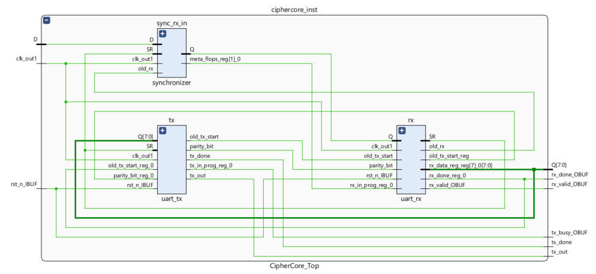

<!---

This file is used to generate your project datasheet. Please fill in the information below and delete any unused
sections.

You can also include images in this folder and reference them in the markdown. Each image must be less than
512 kb in size, and the combined size of all images must be less than 1 MB.
-->

## How it works

The CipherCore is a simple hardware encryption core implemented on an FPGA that communicates through UART and SPI interfaces. It receives plaintext data over UART, applies a lightweight encryption operation, and transmits the encrypted result back over UART. The design demonstrates reliable serial communication, data framing, parity checking, and synchronous processing using an 8-bit data path.

## How to test

Send a UART frame to the chip on the rx bus (9600 baud, 8-bit data, odd parity) and monitor the tx bus to receive the encrypted data.

## External hardware

NOTE: be careful to properly match voltage levels on the UART tx and rx pins.
